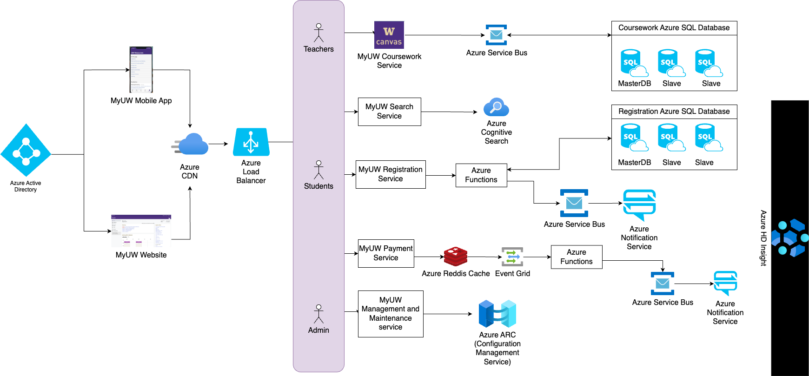

# UW University Website Architecture on Azure

This repository outlines the proposed architecture for the University of Washington's (UW) university website, leveraging various Microsoft Azure services to create a robust, scalable, and efficient cloud-based solution.

## Overview

The architecture is designed to support multiple user roles, including students, teachers, and administrative staff, providing them with access to various features such as coursework management, student registration systems, payment processing, and maintenance management through interconnected Azure services.

## Key Components

1. *Azure Active Directory (AAD):* Provides identity services and ensures secure access control across all components.
2. *MyUW Mobile App:* A mobile application interface for users to interact with the system.
3. *MyUW Website:* The main website portal for desktop users.
4. *Azure CDN:* Utilizes Content Delivery Network for high availability and performance.
5. *Azure Load Balancer:* Distributes incoming network traffic across multiple servers to ensure no single server becomes overwhelmed by demand.

## Services Used

1. *Azure SQL Database:* Hosts the Student Coursework Management System database, ensuring high availability and scalability.
2. *Azure Search Service:* Enhances search capabilities within the coursework management system.
3. *Azure Functions & Logic Apps:* Serverless compute services that enable automated workflows between apps and services.
4. *Redis Cache & Storage Accounts:* Implements caching to improve performance and provides storage solutions, respectively.
5. *Notification Hub & Service Bus Notification:* Manages push notifications across devices, ensuring timely updates.

## Security & Maintenance

- The architecture includes an Admin role with access to an Azure Redis Cache Event Grid, which monitors performance metrics and triggers maintenance tasks as needed.
- An Azure API Management Service oversees interactions between different APIs in use while maintaining security protocols.

## Flowchart 

